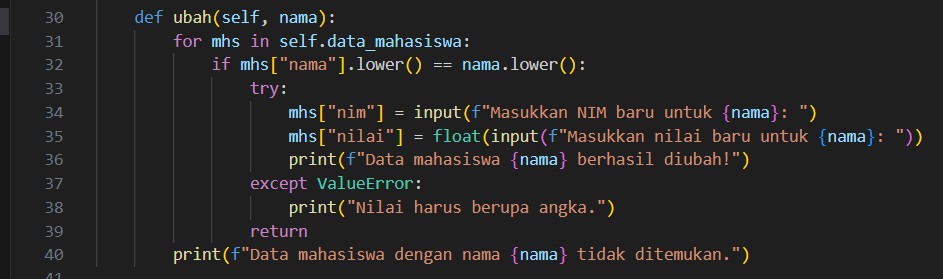

# LAB 8 
## Object-Oriented Programming (OOP)

### Penjelasan Kode Program 
Program ini menggunakan konsep programming berorientasi objek (OOP), yang menjadikan setiap entitas dalam sistem sebagai objek dengan data dan perilaku. Ini mencakup memasukkan, menampilkan, menghapus, dan mengubah data siswa. 

### Penggunaan Class Program 

class digunakan untuk membuat objek dalam pemrograman berbasis objek. Dalam program ini, akan dibuat sebuah kelas bernama Mahasiswa untuk mengelola data mahasiswa yaitu class Mahasiswa: 

- class adalah kata kunci untuk mendefinisikan kelas dalam python. 

- Mahasiswa adalah nama kelas. 

Kelas ini berfungsi sebagai blueprint untuk objek mahasiswa. Setiap objek mahasiswa yang dibuat akan memiliki data mahasiswa dan metode yang dapat digunakan untuk mengelola data tersebut. 

### Atribut data Mahasiswa 

self.data_mahasiswa = []

- self merupakan parameter yang merujuk pada objek itu sendiri. Di dalam kelas, setiap metode harus memiliki self sebagai parameter pertama. 

- data_mahasiswa adalah atribut objek yang menyimpan daftar data_mahasiswa. Atribut ini diinisialisasi sebagai list kosong saat objek di buat. 

def __init__(self):
    self.data_mahasiswa = []

- _init_(self) adalah konstruktor kelas, yang dipanggil ketika objek dari kelas mahasiswa dibuat. Konstruktor ini digunakan untuk menginisialisasi atribut awal dari objek.

- self: Parameter ini merujuk pada objek yang sedang dibuat. Ketika objek Mahasiswa dibuat, Python akan otomatis memanggil konstruktor ini dan membuat atribut data_mahasiswa sebagai list kosong. 

### Fungsi tambah() 

- Fungsi ini digunakan untuk menambahkan data mahasiswa baru ke dalam list data_mahasiswa

- Fungsi ini akan membuat dictionary baru yang menyimpan informasi mahasiswa

- Data mahasiswa ini kemudian ditambahkan ke dalam list self.data_mahasiswa dengan menggunakan metode append(). 

- Setelah itu, program menampilkan pesan yang mengonfirmasi bahwa data mahasiswa berhasil ditambahkan. 

### Fungsi Tampilkan()

- Fungsi ini digunakan untuk menampilkan semua data mahasiswa yang tersimpan dalam list 

- Fungsi pertama-tama memeriksa apakah list self.data_mahasiswa kosong. Jika kosong, program mencetak pesan "Belum ada data mahasiswa!".

- Jika ada data, maka program menampilkan tabel dengan informasi mahasiswa yang terdiri dari No, Nama, NIM, Nilai.

- Program menggunakan enumerate() untuk menampilkan nomor urut mahasiswa dan iterasi melalui semua data mahasiswa yang ada di dalam list data_mahasiswa.

### Fungsi hapus()

- Fungsi ini digunakan untuk menghapus data mahasiswa berdasarkan nama. 

- Fungsi ini mencari mahasiswa berdasarkan nama yang dimasukkan. Proses pencarian dilakukan dengan membandingkan nama mahasiswa dalam list self.data_mahasiswa dengan nama yang diberikan, dengan cara case-insensitive (menggunakan lower()).

-Jika nama ditemukan, data mahasiswa dihapus menggunakan remove() dan program mencetak pesan bahwa data berhasil dihapus.

- Apabila nama tidak ditemukan program akan mencetak pesan kesalahan. 

### Fungsi ubah()

- Fungsi ini digunakan untuk mengubah data mahasiswa berdasarkan nama. 

- Fungsi ini mencari mahasiswa berdasarkan nama, dan jika ditemukan, program meminta input baru untuk NIM, nilai.

- Setelah mendapatkan input baru, nilai-nilai tersebut diperbarui pada dictionary mahasiswa yang ditemukan.

- Program menggunakan try-except untuk memastikan input nilai adalah angka valid (menghindari kesalahan saat pengguna memasukkan nilai non-numerik).

### Fungsi Keluar()

- Fungsi keluar() diwakili oleh pilihan 5 dalam menu utama. Fungsi ini hanya mencetak pesan "Program selesai. Terima kasih!" dan menghentikan eksekusi program.

- Program mencetak pesan terima kasih dan keluar dari loop while, yang mengakhiri eksekusi program.

### Fungsi Menu()

 

- Fungsi ini bertanggung jawab untuk menampilkan menu, menerima input, dan memanggil metode yang sesuai objek. 

### HASIL KODE PROGRAM 

### OPSI ANGKA MEMILIH ANGKA 1
- Menambah data Mahasiwa

Setelah kita memasukkan data, program akan mengonversi inputt menjadi dictionary kunci nama, nim, nilai. Data mahasiswa budi akan disimpan di dalam self.data_mahasiswa, yang pada awalnya adalah list kosong. Pesan ini memberikan konfirmasi bahwa data telah berhasil dimasukkan dan disimpan ke dalam sistem. 

### OPSI MEMILIH ANGKA 2  

Fungsi pertama-tama memeriksa apakah self.data_mahasiswa kosong atau tidak. Jika Kosong akan terdapat sebuah pesan "Belum ada data mahasiswa!". Jika ada data, program akan menampilkan tabel dengan informasi mahasiswa, termasuk Nama, NIM, nilai.

- Apabila ada data mahasiswa

- Apabila tidak ada Mahasiswa 

### OPSI MEMILIH ANGKA 3 

Langkah awal yaitu akan mencari nama mahasiswa dengan nama yang sesuai dengan yang diinputkan pengguna. Fungsi ini menggunakan lower() untuk memastikan pencarian tidak berpengaruh oleh perbedaan huruf kapital. Jika nama ditemukan sesuai dengan yang diinputkan maka program akan menghapus data menggunakan remove(). Program akan mencetak pesan bahwa data pengguna berhasil dihapus atau tidak ditemukan. 

- Apabila Valid 

- Apabila Tidak Valid 

### OPSI MEMILIH ANGKA 4 

Fungsi mencari mahasiswa berdasarkan nama. Jika ditemukan, program meminta input baru untuk NIM, nilai. Jika ada kesalahan input (misalnya memasukkan teks alih-alih angka), program menangkap kesalahan tersebut dan memberi tahu pengguna untuk memasukkan nilai yang benar.

- Apabila Valid

Apabila Tidak Valid 

### OPSI MEMILIH ANGKA 5

## Penjelasan Flowchart 

- Mulai = Program akan dimulai dengan menyiapkan list kosong untuk menyimpan data mahasiswa. 

- Tampilkan menu utama = Program akan menampilkan menu utama dengan opsi berikut 
    - Tambah data 
    - Tampilkan data 
    - Hapus data
    - Ubah data
    - Keluar 

- Input Pilihan = Program akan meminta kita memilih kita opsi dari menu (1-5)

- Tambah data = memasukkan data mahasiswa seperti nama dan nilai 

- Tampilkan data = Program memeriksa apakah apakah ada data di daftar mahasiswa: Jika ada data maka data mahasiswa maka data akan ditampilkan, Jika tidak ada data maka program akan mencetak pesan. 

- Hapus data = Progam akan meminta untuk memasukkan nama mahasiwa yang ingin dihapus. 

- Ubah data : Program akan meminta kita memasukkan nama mahasiwa yang ingin di ubah, lalu masukkan nilai baru 

- End = Program akan berhenti setelah pengguna memilih keluar. 

